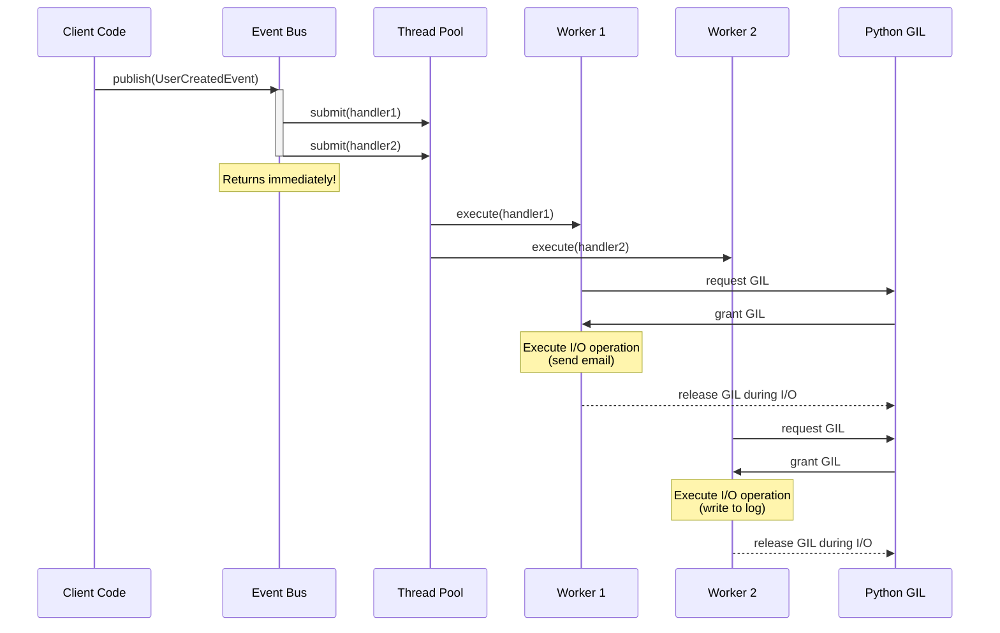

So I've been working on this project where different parts of the system needed to talk to each other. You know, the usual stuff - user signs up, order gets updated, notifications need to be sent... The typical advice? "Just use RabbitMQ or Redis!" But hmm... that felt like bringing a tank to a knife fight 🤷‍♂️. Especially that time to the market matters and I was the only dev there. So I wanted to be able to move fast. 

## The Problem

I needed something simple:

- Async event handling (fire and forget)
- No fancy setup
- Easy to test
- Keeps different parts of the code separate

## The Solution: Let's Build Our Own

Here's what I came up with:

```python
from concurrent.futures import ThreadPoolExecutor
from typing import Callable, Dict, List
from dataclasses import dataclass

@dataclass
class Event:
    event_type: str

class SimpleEventBus:
    def __init__(self):
        self._handlers: Dict[str, List[Callable]] = {}
        self._executor = ThreadPoolExecutor(max_workers=4)

    def publish(self, event: Event) -> None:
        if event.event_type in self._handlers:
            for handler in self._handlers[event.event_type]:
                # Fire-and-forget execution
                self._executor.submit(handler, event)

    def subscribe(self, event_type: str, handler: Callable) -> None:
        if event_type not in self._handlers:
            self._handlers[event_type] = []
        self._handlers[event_type].append(handler)

```

## So How Does Python Threading Actually Work?

This one is crucial to understand what's happening here. 

### The Global Interpreter Lock (GIL)

First thing you need to know - Python has this thing called the GIL. It's basically Python's way of managing memory safely in a multi-threaded environment. Here's how it actually works:

1. Only one thread can execute Python code at a time
2. When a thread starts doing I/O operations (like HTTP requests, file operations, or DB calls), it releases the GIL
3. The GIL then becomes available for other threads to use
4. This is why I/O heavy tasks can actually run in parallel!

A small detail that many don't know: When you're doing CPU work (like calculations), you're stuck with one thread at a time. But for I/O work (which is what most event handlers do), Python can run multiple threads effectively in parallel. This is perfect for our event bus since most handlers are doing I/O anyway!

### CPU vs I/O Tasks

So here's the cool part:

- CPU tasks (like heavy calculations) - one at a time, no way around it
- I/O tasks (like making HTTP calls or reading files) - Python's like "go ahead, do your thing!" and lets multiple threads work

Check out what this looks like in practice. Here's how things flow when we publish an event:



When one thread is waiting for I/O (like sending an email), it lets go of the GIL and other threads can do their thing. That's why this works so well for our event handlers - they're mostly doing I/O stuff anyway!

And how this looks like on CPU:

```mermaid
gantt
    title Thread Execution Patterns with GIL
    dateFormat X
    axisFormat %s

    section CPU-Bound Tasks
    Thread 1 (CPU Calculation)    :crit, cpu1, 0,  5
    Waiting for GIL              :wait1, 5,  6
    Thread 2 (CPU Calculation)    :crit, cpu2, 6,  11
    Waiting for GIL              :wait2, 11, 12
    Thread 3 (CPU Calculation)    :crit, cpu3, 12, 17
    
    section I/O-Bound Tasks
    Thread 4 (DB Query)          :active, io1, 0,  8
    Thread 5 (HTTP Request)      :active, io2, 2,  10
    Thread 6 (File Write)        :active, io3, 4,  12
    Thread 7 (Email Send)        :active, io4, 6,  14
    Thread 8 (Redis Operation)   :active, io5, 8,  16
    
```



1. CPU-Bound Section:
    - Notice how CPU tasks (red) NEVER overlap
    - Each thread must wait for the GIL before proceeding
    - Small gaps between tasks show GIL handoff time
2. I/O-Bound Section:
    - Multiple I/O operations (blue) run in parallel
    - DB queries, HTTP requests, file operations all overlap
    - Much better throughput than CPU-bound tasks

## How Does It Work?

The magic happens in these two lines:

```python
def publish(self, event: Event) -> None:
    self._executor.submit(handler, event) # This is the key!
```

When you publish an event:

1. Your code continues running immediately
2. The event handlers run in the background
3. You don't have to wait for them to finish. 

## Real World Example

Let's see how this actually works on some example:

```python
@dataclass
class OrderPlaced(Event):
    order_id: str
    user_id: str
    items: list[dict]
    total_amount: Decimal
    shipping_address: dict

bus = SimpleEventBus()

# Different parts of the system handle different responsibilities
@SimpleEventBus.handler("order_placed")
def notify_warehouse(event: OrderPlaced):
    """Warehouse needs to know about new orders to prepare shipment"""
    warehouse_client.create_shipment_order(
        order_id=event.order_id,
        items=event.items,
        address=event.shipping_address
    )

@SimpleEventBus.handler("order_placed")
def send_confirmation_email(event: OrderPlaced):
    """Customer should get order confirmation"""
    email_template = load_template("order_confirmation")
    send_email(
        to=get_user_email(event.user_id),
        subject=f"Order #{event.order_id} Confirmation",
        body=email_template.render(
            items=event.items,
            total=event.total_amount
        )
    )

@SimpleEventBus.handler("order_placed")
def update_inventory(event: OrderPlaced):
    """Update stock levels"""
    for item in event.items:
        inventory.decrease_stock(
            product_id=item['id'],
            quantity=item['quantity']
        )

@SimpleEventBus.handler("order_placed")
def trigger_analytics(event: OrderPlaced):
    """Track business metrics"""
    analytics.track_sale(
        order_id=event.order_id,
        amount=event.total_amount,
        user_id=event.user_id
    )

# In your order service, you just:
class OrderService:
    def place_order(self, user_id: str, items: list, address: dict) -> str:
        # Core business logic
        order = Order.create(
            user_id=user_id,
            items=items,
            shipping_address=address
        )
        
        # Just publish the event - everything else happens automatically!
        bus.publish(OrderPlaced(
            order_id=order.id,
            user_id=user_id,
            items=items,
            total_amount=order.total,
            shipping_address=address
        ))
        
        return order.id
```

The beauty of this approach is that:

- OrderService doesn't need to know about emails, warehouses, or analytics
- Adding new functionality is just adding new handlers
- Each handler can fail independently without affecting others
- Easy to test each piece in isolation

For example, adding loyalty points later is as simple as:

```python
@SimpleEventBus.handler("order_placed")
def award_loyalty_points(event: OrderPlaced):
    points = calculate_points(event.total_amount)
    loyalty_service.add_points(
        user_id=event.user_id,
        points=points,
        reason=f"Order #{event.order_id}"
    )
```

No need to modify the existing order code - just add the new handler, test it separately and mark this Jira ticket as done! 

## Testing Is Super Easy

Here's a nice trick for testing - create a synchronous executor. I’m using this one to be able to assert on more e2e tests where I want to make sure that something has happened in the background.  

```python
class SyncExecutor(Executor):
    """Runs everything in the same thread - perfect for testing"""
    def submit(self, fn: Callable[P, T], /, *args: P.args, **kwargs: P.kwargs) -> Future[T]:
        result = fn(*args, **kwargs)
        future: Future[T] = Future()
        future.set_result(result)
        return future

def test_user_created_handlers():
    # Simple list to track handler calls
    handled_events = []
    
    def test_handler(event: UserCreated):
        handled_events.append(event)
    
    # Setup bus with sync executor
    bus = SimpleEventBus(executor=SyncExecutor())
    bus.subscribe("user_created", test_handler)
    
    # Publish test event
    test_event = UserCreated("test-id", "test@example.com")
    bus.publish(test_event)
    
    # With SyncExecutor, we can check immediately
    assert len(handled_events) == 1
    assert handled_events[0].user_id == "test-id"
```

## Thread Safety Considerations

When you're working with threads, there are a few gotchas you need to watch out for. Let me show you some real problems I've hit and how to solve them.

### 1. Handler State

The most common issue? Shared state in handlers. Look at this:

```python
# DON'T DO THIS
total_orders = 0

@SimpleEventBus.handler("order_placed")
def track_orders(event: OrderPlaced):
    global total_orders
    total_orders += 1  # 💥 Race condition!
```

Instead, either use thread-safe counters or better yet, avoid shared state:

```python
from threading import Lock

class OrderTracker:
    def __init__(self):
        self._count = 0
        self._lock = Lock()
    
    def increment(self):
        with self._lock: # this is like public toilet. Only one person at a time. 
            self._count += 1
            return self._count

# Better approach - use the tracker
tracker = OrderTracker()

@SimpleEventBus.handler("order_placed")
def track_orders(event: OrderPlaced):
    new_count = tracker.increment()
    logger.info(f"Processed order {event.order_id}. Total: {new_count}")
```

### 2. Resource Management

Another classic problem - sharing resources between handlers. Here's what not to do:

```python
# DON'T DO THIS - shared connection between threads
db_connection = create_db_connection()

@SimpleEventBus.handler("order_placed")
def save_order(event: OrderPlaced):
    db_connection.execute(  # 💥 Not thread-safe!
        "INSERT INTO orders VALUES (?)", 
        [event.order_id]
    )
```

Instead, manage resources per handler call:

```python
# DO THIS - each handler gets its own connection
@SimpleEventBus.handler("order_placed")
def save_order(event: OrderPlaced):
    with create_db_connection() as conn:  # Thread-safe! 
        conn.execute(
            "INSERT INTO orders VALUES (?)",
            [event.order_id]
        )
```

### The Main Rules

1. Never share mutable state between handlers
2. Use thread-safe data structures when you must share
3. Manage resources (DB connections, API clients) per handler call
4. When in doubt, use Queue from the standard library

> **Remember**: The event bus takes care of most thread safety for you. These issues usually come up in the handlers themselves. Keep your handlers simple and stateless, and you'll avoid most problems! 🎯
> 

## When Should You Use This?

This simple approach is perfect when:

- You don't need events to survive app restarts
- You're not handling thousands of events per second
- You want to avoid complex infrastructure
- You need something easy to test

But maybe look at RabbitMQ or Kafka when you need:

- Events that persist
- Guaranteed delivery
- Super high throughput
- Communication between different services

## The Results?

We've been running this for a while now. It just works. No maintenance headaches, and when I need to add new events or handlers, it's straightforward. Also if needed it will be pretty easy to move to more advanced solutions like Kafka etc. cuz the whole infrastructure is already in place throwing events. 

Remember: Sometimes the simple solution is the right solution 🎯